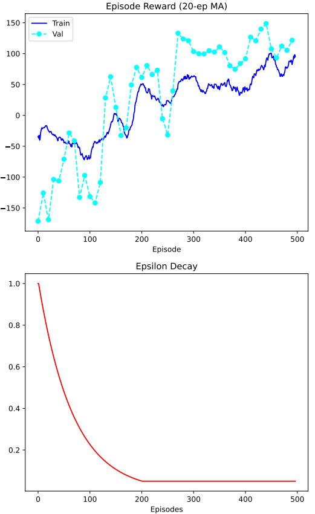
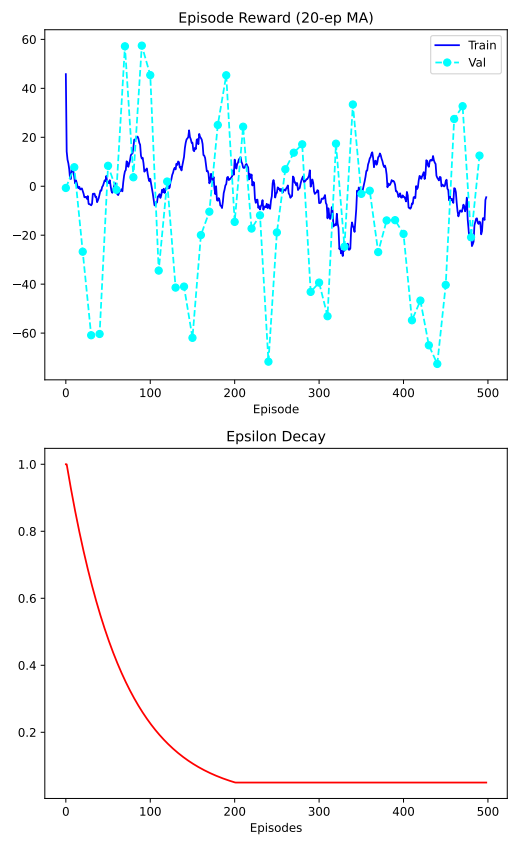

# Midas: A Deep Q-Network Agent for Gold (XAUUSD) Trading

Bachelor's thesis project in Computer Science (at Stockholm University) exploring whether a Deep
Q-Network can learn a profitable trading policy for gold, and whether technical indicators actually
help it do so.

**Status:** Complete. 
- This repo is
maintained as a portfolio artifact; see the accompanying thesis [here](https://www.diva-portal.org/smash/record.jsf?pid=diva2%3A2066276&dswid=-4202).

## Outline

---

- [Key findings](#key-findings)
- [Overview](#overview)
- [Architecture](#architecture)
- [Training data](#training-data)
- [Statistical methodology](#statistical-methodology)
- [Results](#results)
- [Limitations](#limitations)
- [Setup](#setup)
- [Reproducing the results](#reproducing-the-results)
- [Live deployment](#live-deployment)
- [Authors](#authors)


---


## Key findings

Six of eight trained DQN variants significantly outperformed a buy-and-hold
benchmark on risk-adjusted return (Sharpe ratio) on two years of held-out
XAUUSD test data (Kruskal-Wallis + Bonferroni-corrected Mann-Whitney U,
p < 0.001, large effect sizes r = 0.86–0.97) spanning from 2023-2024.

A secondary and more surprising finding emerged from comparing the DQN
variants against each other: a **Price-Only agent** — trained on raw OHLC
price alone, with no technical indicators — achieved the best mean Sharpe
ratio (~1.41), matching or beating every indicator-augmented variant.
MACD in particular showed no significant advantage over buy-and-hold when
used alone or paired only with RSI, while ATR-based agents consistently
ranked at or near the top.

A full write-up of *why* we think this happens is here: **[link to blog post
— TBD]**.

---

## Overview

- **Task:** learn a trading policy for XAUUSD (gold) from historical OHLC
  data, with the option to condition on technical indicators.
- **Approach:** Dueling DQN + Double DQN, trained against a custom
  Gymnasium-compatible environment wrapping MetaTrader5 (MT5) historical
  data.
- **Comparison:** multiple agent variants were trained and evaluated against
  each other — a Price-Only agent and several indicator-conditioned variants
  (including MACD) — under identical training/evaluation protocol.
- **Evaluation:** agents were selected and compared on validation Sharpe
  ratio, not on raw reward or loss.

## Architecture

| Component        | Details                                                                                 |
|------------------|-----------------------------------------------------------------------------------------|
| Environment      | Custom Gymnasium-compatible env wrapping MT5 OHLC data                                  |
| Model            | Dueling DQN + Double DQN                                                                |
| Replay buffer    | 500,000 transitions                                                                     |
| Risk management  | ATR-based stop-loss / take-profit sizing                                                |
| Model selection  | Validation checkpointing on Sharpe ratio                                                |
| Data / execution | MetaTrader5 (MT5) — historical data collection and live *paper-trading* order execution |
| Stack            | Python, PyTorch, pandas, numpy, scipy                                                   |

Full hyperparameter configurations for each trained variant are in
[hyperparameters.yml](hyperparameters.yml) — see
[Reproducing the results](#reproducing-the-results) for how the preset
profiles map to the results below.

## Training data

Each agent was trained for 500 episodes, with each episode consisting of
5,000 steps and each step corresponding to one 15-minute XAUUSD bar. Episode
starting points were sampled randomly from the historical dataset to improve
generalizability, rather than always starting from the same point in
history. In total, this exposed each agent to 2,500,000 step-observations of
15-minute price action, drawn from a shared historical window spanning
**2016-01-01 to 2022-12-31** — a period covering several distinct market
regimes (e.g. low-volatility and high-volatility stretches, differing rate
environments), which the random episode starts were intended to sample
across rather than overfit to any single regime.

## Statistical methodology

Performance differences between agent variants were tested for significance
rather than reported as bare means:

- **Omnibus test:** Kruskal-Wallis, across all agent variants.
- **Pairwise tests:** Mann-Whitney U, with Bonferroni correction for multiple
  comparisons.
- **Effect size:** rank-biserial correlation (r), the non-parametric
  counterpart to Cohen's d, appropriate given the non-normal distributions.
- **Sharpe annualization:** daily return aggregation, scaled by √252.

## Results
|  Agent variant   | Mean Sharpe | vs. Buy-and-Hold  |
|:----------------:|:-----------:|:-----------------:|
|    Price-Only    |    1.411    | p < .001, r = .97 |
|     ATR-MACD     |    1.394    | p < .001, r = .90 |
|       RSI        |    1.286    | p < .001, r = .92 |
|     ATR-RSI      |    1.191    | p < .001, r = .93 |
|  All-Indicators  |    1.169    | p < .001, r = .86 |
|       ATR        |    1.093    | p < .001, r = .91 |
|     MACD-RSI     |    0.192    | p = 1.000 (n.s.)  |
|       MACD       |    0.060    |  p = .086 (n.s.)  |
| **Buy-and-Hold** |  **0.304**  |   — (baseline)    |

*Statistical significance: pairwise differences between variants were tested
via Bonferroni-corrected Mann-Whitney U (see
[Methodology](#statistical-methodology)).*
<!-- TODO: annotate the table above with which pairwise comparisons cleared
significance (e.g. asterisks + a footnote key), or link directly to the
notebook/paper section with the full test statistics. In particular, the
Price-Only vs. ATR-MACD gap (1.411 vs. 1.394) is small — state explicitly
whether it was found significant or not. -->

### Training dynamics

To evaluate the underlying learning dynamics of the models, the training and
validation reward curves were monitored continuously throughout the
execution of the DQN algorithm. Two representative examples are shown below:
a profitable variant ([ATR agent training graph](midas-models/atr/midas-atr.png))
and the weakest variant ([MACD agent training graph](midas-models/macd/midas-macd.png)).
The ATR agent exhibits a distinct, monotonic upward trend in its 20-episode
moving average reward, indicating a structured optimization of its trading
policy through environmental exploration. Crucially, the periodic validation
performance — executed deterministically with the exploration constant (ϵ)
set to zero — closely tracks the training curve. This tight coupling
demonstrates that the ATR agent successfully converged toward a stable,
generalizable policy.


The MACD agent shows the opposite pattern. Its training dynamics are highly
erratic, and it never extracts a reliable trading signal: its 20-episode
mean reward follows an overall downward trajectory, starting near zero and
deteriorating into net-negative territory by the end of training. This
decline is punctuated only by brief, volatile upward fluctuations lasting
roughly 50 episodes before aggressively reversing. Its validation
performance is completely uncoupled from the training mean, swinging
unpredictably between extreme positive and negative values — the opposite
of the tight training/validation coupling seen in the ATR agent, and a
strong sign that it failed to converge on a stable policy rather than
merely converging on a weak one.


<table>
  <tr>
    <td align="center">
      <br />
      <sub><b>ATR agent:</b> training reward converges smoothly, validation tracks training closely.</sub>
    </td>
    <td align="center">
      <br />
      <sub><b>MACD agent:</b> erratic training, validation completely decoupled from training — a clear non-convergence signature.</sub>
    </td>
  </tr>
</table>


## Limitations

Stated plainly rather than buried:

- **Live test bar-resolution mismatch.** The live MT5 paper-trading test ran
  on 1-minute bars against a model trained on 15-minute bars. This
  invalidates any *quantitative* conclusion from that live test — the
  results there should be read as directional/illustrative only. The
  backtested, statistically-tested results above are unaffected by this
  issue.
<!-- TODO: add any other known limitations from the repo, e.g. data range,
  transaction cost assumptions, slippage modeling, single-instrument scope. -->

## Setup

Requires Python 3.10+. Note: the `MetaTrader5` package is Windows-native;
Linux/Mac users will need Wine or a Windows VM to run data collection and
live testing components. Backtesting and training do not require MT5 once
data has been collected.

```bash
pip install -r requirements.txt
```

## Reproducing the results

### Download market data

```bash
python data_fetch.py
python data_process.py
```

### Train an agent

```bash
python trading_agent.py <AGENT_NAME> --train
```

- Replace `<AGENT_NAME>` with an existing hyperparameter profile in
  [hyperparameters.yml](hyperparameters.yml). The preset profiles are the
  ones that were used in the final experiment.
- During training, a datapoint is generated and plotted for each training
  and validation episode.

### Test the agent

Once training completes, you should have a trained agent saved as
**`<AGENT_NAME>.pt`** in the [/results](/results) directory.

Change the **split** hyperparameter in
[hyperparameters.yml](hyperparameters.yml) to `test` and run:

```bash
# replace AGENT_NAME with a trained agent
python trading_agent.py <AGENT_NAME>
```

The agent's test results are generated in the [results](results) directory.

### Hyperparameters

The [hyperparameters](hyperparameters.yml) are quite extensive but already
contain the configuration profiles used for the final experiment. The most
important parameters are:

- **data_format**: `"OHLCV"` or `"wick"`
- **split**: `"train"` or `"test"`
- **indicators**: `true` or `false` for any indicator parameter:
  - **atr**
  - **macd**
  - **rsi**

The **data_format** parameter determines whether the input is in Open, High,
Low, Close, Volume (**OHLCV**) form, or in **wick format** — high wick
(High − Open), low wick (Close − Low), and trend (Open / Close).

The **split** parameter determines whether the agent is run in `test` or
`train` mode. `test` mode assumes an agent has already been trained and
saved as `<AGENT_NAME>.pt` in the [results](results) directory before it
runs — running `test` without a corresponding trained agent will fail.

## Live deployment

Beyond backtesting, all nine agent variants were deployed simultaneously
against live XAUUSD market data via MetaTrader5, using isolated Docker
containers per agent to prevent cross-contamination of trades. This served
as a qualitative check that the trained agents execute coherent behavior
under real market conditions rather than a formal performance test (see
Limitations). Several backtest trends held directionally: the ATR agent
remained the strongest DQN performer and MACD-based agents remained weak,
though the small sample size and a bar-resolution mismatch versus training
prevent any statistical claims from this test alone.


<!-- TODO: replace with full, correctly formatted citations from the repo. -->

## Authors

<!-- TODO: names, and license — fill in from the repo. -->

---
The authors of this project are [Simon Jonsson](https://github.com/Nomis778) and [Björn Moderatho Winther](https://github.com/modwin), the published bachelor's thesis can be found [here](https://www.diva-portal.org/smash/record.jsf?pid=diva2%3A2066276&dswid=-7338). 

*This project was completed as a bachelor's thesis at Stockholm University.
It is shared here as a portfolio artifact; it is not a production trading
system and should not be used to trade live capital.*
